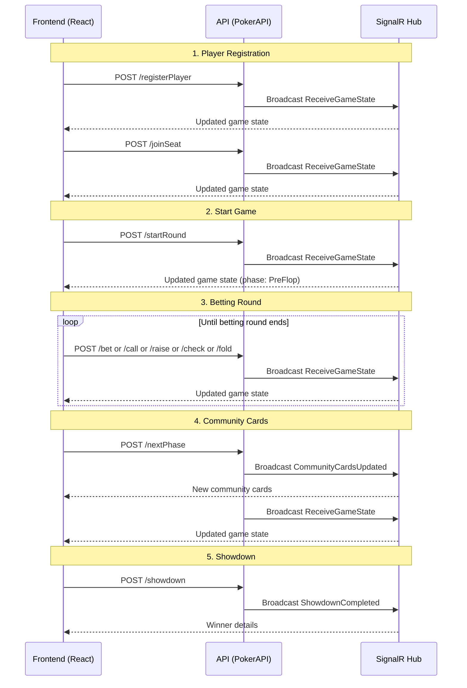

# PokerAPI Documentation

Dokumentasi lengkap untuk backend Poker API yang digunakan untuk membangun frontend React.

---

## 📋 Daftar Isi
- [Informasi Umum](#informasi-umum)
- [REST API Endpoints](#rest-api-endpoints)
- [SignalR Hub (Real-time)](#signalr-hub-real-time)
- [Data Types & Enums](#data-types--enums)
- [Response Schemas](#response-schemas)
- [Contoh Penggunaan React](#contoh-penggunaan-react)

---

## Informasi Umum

| Property | Value |
|----------|-------|
```markdown
| **Base URL** | `http://localhost:5175/api/GameControllerAPI` |
```
```markdown
| **SignalR Hub** | `http://localhost:5175/pokerHub` |
```
| **Content-Type** | `application/json` |
| **CORS Origins** | `http://localhost:5148`, `http://localhost:5071` |

---

## REST API Endpoints

### 1. Player Management

#### `POST /api/GameControllerAPI/addPlayer`
Menambahkan player baru ke game dengan seat tertentu.

| Parameter | Type | Location | Required | Default | Description |
|-----------|------|----------|----------|---------|-------------|
| `name` | string | query | ✅ | - | Nama player |
| `chips` | int | query | ❌ | 1000 | Jumlah chip awal |
| `seatIndex` | int | query | ❌ | -1 | Index kursi (0-9), -1 = auto |

**Request:**
```http
POST /api/GameControllerAPI/addPlayer?name=John&chips=1500&seatIndex=0
```

**Response Success (200):**
```json
{
  "isSuccess": true,
  "message": "Player added"
}
```

**Response Error (400):**
```json
{
  "isSuccess": false,
  "message": "Player already exists"
}
```

---

#### `POST /api/GameControllerAPI/registerPlayer`
Mendaftarkan player tanpa seat (untuk lobby system).

| Parameter | Type | Location | Required | Description |
|-----------|------|----------|----------|-------------|
| `playerName` | string | query | ✅ | Nama player |
| `chipStack` | int | query | ✅ | Jumlah chip awal |

**Request:**
```http
POST /api/GameControllerAPI/registerPlayer?playerName=John&chipStack=1000
```

**Response Success (200):**
```json
{
  "success": true,
  "message": "Player registered"
}
```

---

#### `POST /api/GameControllerAPI/joinSeat`
Player yang sudah terdaftar memilih seat.

| Parameter | Type | Location | Required | Description |
|-----------|------|----------|----------|-------------|
| `playerName` | string | query | ✅ | Nama player |
| `seatIndex` | int | query | ✅ | Index kursi (0-9) |

**Request:**
```http
POST /api/GameControllerAPI/joinSeat?playerName=John&seatIndex=3
```

**Response Success (200):**
```json
{
  "isSuccess": true,
  "message": "Player John menempati seat 3"
}
```

---

#### `POST /api/GameControllerAPI/removePlayer`
Menghapus player dari game.

| Parameter | Type | Location | Required | Description |
|-----------|------|----------|----------|-------------|
| `name` | string | query | ✅ | Nama player |

**Request:**
```http
POST /api/GameControllerAPI/removePlayer?name=John
```

**Response Success (200):**
```json
{
  "isSuccess": true,
  "message": "Player removed"
}
```

---

#### `POST /api/GameControllerAPI/addchips`
Menambahkan chip ke player (rebuy/top-up).

| Field | Type | Location | Required | Description |
|-------|------|----------|----------|-------------|
| `PlayerName` | string | body | ✅ | Nama player |
| `Amount` | int | body | ✅ | Jumlah chip (harus > 0) |

**Request:**
```http
POST /api/GameControllerAPI/addchips
Content-Type: application/json

{
  "PlayerName": "John",
  "Amount": 500
}
```

**Response Success (200):**
```json
{
  "isSuccess": true,
  "message": "Chips added successfully"
}
```

---

### 2. Round Management

#### `POST /api/GameControllerAPI/startRound`
Memulai round baru (deal kartu, post blinds).

**Request:**
```http
POST /api/GameControllerAPI/startRound
```

**Response Success (200):**
```json
{
  "isSuccess": true,
  "message": "Round started"
}
```

---

#### `POST /api/GameControllerAPI/nextPhase`
Melanjutkan ke phase berikutnya (PreFlop → Flop → Turn → River → Showdown).

**Request:**
```http
POST /api/GameControllerAPI/nextPhase
```

**Response Success (200):**
```json
{
  "isSuccess": true,
  "message": "Phase advanced"
}
```

---

### 3. Betting Actions

#### `POST /api/GameControllerAPI/bet`
Player melakukan bet.

| Parameter | Type | Location | Required | Description |
|-----------|------|----------|----------|-------------|
| `name` | string | query | ✅ | Nama player |
| `amount` | int | query | ✅ | Jumlah bet |

**Request:**
```http
POST /api/GameControllerAPI/bet?name=John&amount=100
```

**Response Success (200):**
```json
{
  "isSuccess": true,
  "message": "Bet placed successfully"
}
```

---

#### `POST /api/GameControllerAPI/call`
Player melakukan call (mengikuti current bet).

| Parameter | Type | Location | Required | Description |
|-----------|------|----------|----------|-------------|
| `name` | string | query | ✅ | Nama player |

**Request:**
```http
POST /api/GameControllerAPI/call?name=John
```

**Response Success (200):**
```json
{
  "isSuccess": true,
  "message": "Call successful"
}
```

---

#### `POST /api/GameControllerAPI/raise`
Player melakukan raise.

| Parameter | Type | Location | Required | Description |
|-----------|------|----------|----------|-------------|
| `name` | string | query | ✅ | Nama player |
| `amount` | int | query | ✅ | Jumlah raise total |

**Request:**
```http
POST /api/GameControllerAPI/raise?name=John&amount=200
```

**Response Success (200):**
```json
{
  "isSuccess": true,
  "message": "Raise successful"
}
```

---

#### `POST /api/GameControllerAPI/check`
Player melakukan check (jika current bet = 0 atau sudah match).

| Parameter | Type | Location | Required | Description |
|-----------|------|----------|----------|-------------|
| `name` | string | query | ✅ | Nama player |

**Request:**
```http
POST /api/GameControllerAPI/check?name=John
```

**Response Success (200):**
```json
{
  "isSuccess": true,
  "message": "Check performed"
}
```

---

#### `POST /api/GameControllerAPI/fold`
Player melakukan fold (menyerah).

| Parameter | Type | Location | Required | Description |
|-----------|------|----------|----------|-------------|
| `name` | string | query | ✅ | Nama player |

**Request:**
```http
POST /api/GameControllerAPI/fold?name=John
```

**Response Success (200):**
```json
{
  "isSuccess": true,
  "message": "Folded"
}
```

---

#### `POST /api/GameControllerAPI/allin`
Player melakukan all-in (taruh semua chip).

| Parameter | Type | Location | Required | Description |
|-----------|------|----------|----------|-------------|
| `name` | string | query | ✅ | Nama player |

**Request:**
```http
POST /api/GameControllerAPI/allin?name=John
```

**Response Success (200):**
```json
{
  "isSuccess": true,
  "message": "All-in successful"
}
```

---

### 4. Game State & Showdown

#### `GET /api/GameControllerAPI/state`
Mengambil state game saat ini (polling alternatif selain SignalR).

**Request:**
```http
GET /api/GameControllerAPI/state
```

**Response (200):**
```json
{
  "gameState": "InProgress",
  "phase": "Flop",
  "currentPlayer": "John",
  "currentBet": 100,
  "pot": 350,
  "communityCards": [
    "Ace of Spades",
    "King of Hearts",
    "Ten of Diamonds"
  ],
  "players": [
    {
      "name": "John",
      "chipStack": 900,
      "currentBet": 100,
      "isFolded": false,
      "seatIndex": 0,
      "state": "Active",
      "hand": ["Ace of Hearts", "King of Spades"]
    },
    {
      "name": "Jane",
      "chipStack": 850,
      "currentBet": 100,
      "isFolded": false,
      "seatIndex": 1,
      "state": "Active",
      "hand": ["Queen of Clubs", "Jack of Diamonds"]
    }
  ],
  "showdown": null
}
```

---

#### `POST /api/GameControllerAPI/showdown`
Menyelesaikan round dan menentukan pemenang.

**Request:**
```http
POST /api/GameControllerAPI/showdown
```

**Response (200):**
```json
{
  "winners": ["John"],
  "rank": "FullHouse"
}
```

---

## SignalR Hub (Real-time)

### Connection
```javascript
import * as signalR from '@microsoft/signalr';

const connection = new signalR.HubConnectionBuilder()
  .withUrl('http://localhost:5071/pokerHub')
  .withAutomaticReconnect()
  .build();

await connection.start();
```

### Events yang Di-broadcast

| Event Name | Trigger | Payload |
|------------|---------|---------|
| `ReceiveGameState` | Setiap perubahan state | [GameStateDto](#gamestatedto) |
| `CommunityCardsUpdated` | Flop/Turn/River | `{ communityCards: string[] }` |
| `ShowdownCompleted` | Showdown selesai | [ShowdownResult](#showdownresult-event-payload) |
| `ReceiveMessage` | General message | `string` |
| `ShowdownStateUpdated` | Showdown state update | `object` |

### Event Payloads

#### `ReceiveGameState`
```json
{
  "gameState": "InProgress",
  "phase": "Turn",
  "currentPlayer": "John",
  "currentBet": 200,
  "pot": 600,
  "communityCards": ["Ace of Spades", "King of Hearts", "Ten of Diamonds", "Five of Clubs"],
  "players": [...],
  "showdown": null
}
```

#### `CommunityCardsUpdated`
```json
{
  "communityCards": ["Ace of Spades", "King of Hearts", "Ten of Diamonds"]
}
```

#### `ShowdownCompleted`
```json
{
  "winners": ["John"],
  "players": [
    {
      "name": "John",
      "seatIndex": 0,
      "hand": ["Ace of Hearts", "King of Spades"],
      "handRank": "FullHouse",
      "chipStack": 1050,
      "isFolded": false,
      "isWinner": true,
      "winnings": 300
    },
    {
      "name": "Jane",
      "seatIndex": 1,
      "hand": ["Queen of Clubs", "Jack of Diamonds"],
      "handRank": "TwoPair",
      "chipStack": 800,
      "isFolded": false,
      "isWinner": false,
      "winnings": 0
    }
  ],
  "communityCards": ["Ace of Spades", "King of Hearts", "Ten of Diamonds", "Five of Clubs", "Two of Spades"],
  "handRank": "FullHouse",
  "pot": 600,
  "message": "John wins with FullHouse"
}
```

---

## Data Types & Enums

### Suit (Jenis Kartu)
| Value | Description |
|-------|-------------|
| `Hearts` | ♥️ Hati |
| `Diamonds` | ♦️ Wajik |
| `Clubs` | ♣️ Keriting |
| `Spades` | ♠️ Sekop |

### Rank (Nilai Kartu)
| Value | Number | Description |
|-------|--------|-------------|
| `Two` | 2 | Dua |
| `Three` | 3 | Tiga |
| `Four` | 4 | Empat |
| `Five` | 5 | Lima |
| `Six` | 6 | Enam |
| `Seven` | 7 | Tujuh |
| `Eight` | 8 | Delapan |
| `Nine` | 9 | Sembilan |
| `Ten` | 10 | Sepuluh |
| `Jack` | 11 | Jack |
| `Queen` | 12 | Queen |
| `King` | 13 | King |
| `Ace` | 14 | Ace |

### HandRank (Ranking Tangan Poker)
| Value | Rank | Description |
|-------|------|-------------|
| `HighCard` | 1 | Kartu tertinggi |
| `Pair` | 2 | Sepasang |
| `TwoPair` | 3 | Dua pasang |
| `ThreeOfAKind` | 4 | Three of a kind |
| `Straight` | 5 | Straight |
| `Flush` | 6 | Flush |
| `FullHouse` | 7 | Full house |
| `FourOfAKind` | 8 | Four of a kind |
| `StraightFlush` | 9 | Straight flush |

### GamePhase (Fase Permainan)
| Value | Description |
|-------|-------------|
| `PreFlop` | Sebelum community cards |
| `Flop` | 3 kartu pertama community |
| `Turn` | Kartu ke-4 community |
| `River` | Kartu ke-5 community |
| `Showdown` | Pembukaan kartu |

### PlayerState (Status Player)
| Value | Description |
|-------|-------------|
| `Active` | Masih bermain |
| `Folded` | Sudah fold |
| `AllIn` | All-in |
| `Eliminated` | Tereliminasi (chip habis) |

### GameState (Status Game)
| Value | Description |
|-------|-------------|
| `WaitingForPlayers` | Menunggu player |
| `InProgress` | Game berjalan |
| `Completed` | Game selesai |

---

## Response Schemas

### ServiceResult
```typescript
interface ServiceResult {
  isSuccess: boolean;
  message: string;
}

interface ServiceResult<T> {
  isSuccess: boolean;
  message: string;
  data: T;
}
```

### GameStateDto
```typescript
interface GameStateDto {
  gameState: string;          // "WaitingForPlayers" | "InProgress" | "Completed"
  phase: string;              // "PreFlop" | "Flop" | "Turn" | "River" | "Showdown"
  currentPlayer: string | null;
  currentBet: number;
  pot: number;
  communityCards: string[];   // e.g., ["Ace of Spades", "King of Hearts"]
  players: PlayerPublicStateDto[];
  showdown: ShowdownDto | null;
}
```

### PlayerPublicStateDto
```typescript
interface PlayerPublicStateDto {
  name: string;
  chipStack: number;
  currentBet: number;
  isFolded: boolean;
  seatIndex: number;          // 0-9, or -1 if not seated
  state: string;              // "Active" | "Folded" | "AllIn" | "Eliminated"
  hand: string[];             // Player's cards (visible during showdown)
}
```

### ShowdownResult (Event Payload)
```typescript
interface ShowdownResult {
  winners: string[];          // List of winner names
  players: Array<{
    name: string;
    seatIndex: number;
    hand: string[];           // e.g. ["Ace of Spades", "King of Hearts"]
    handRank: string;         // e.g. "FullHouse"
    chipStack: number;
    isFolded: boolean;
    isWinner: boolean;
    winnings: number;         // Amount won from pot
  }>;
  communityCards: string[];
  handRank: string;           // Winning hand rank
  pot: number;
  message: string;
}

### ShowdownDto (helper for GameState)
```typescript
interface ShowdownDto {
  winners: string[];          // Names of winning players
  handRank: string;           // e.g., "FullHouse"
  message: string;            // e.g., "John wins with FullHouse"
}
```

### AddChipsRequest
```typescript
interface AddChipsRequest {
  PlayerName: string;
  Amount: number;
}
```

---

## Contoh Penggunaan React

### Setup API Service
```typescript
// src/services/pokerApi.ts
const BASE_URL = 'http://localhost:5071/api/GameControllerAPI';

export const pokerApi = {
  // State
  getState: () => 
    fetch(`${BASE_URL}/state`).then(res => res.json()),

  // Player Management
  registerPlayer: (playerName: string, chipStack: number) =>
    fetch(`${BASE_URL}/registerPlayer?playerName=${playerName}&chipStack=${chipStack}`, {
      method: 'POST'
    }).then(res => res.json()),

  joinSeat: (playerName: string, seatIndex: number) =>
    fetch(`${BASE_URL}/joinSeat?playerName=${playerName}&seatIndex=${seatIndex}`, {
      method: 'POST'
    }).then(res => res.json()),

  removePlayer: (name: string) =>
    fetch(`${BASE_URL}/removePlayer?name=${name}`, {
      method: 'POST'
    }).then(res => res.json()),

  addChips: (playerName: string, amount: number) =>
    fetch(`${BASE_URL}/addchips`, {
      method: 'POST',
      headers: { 'Content-Type': 'application/json' },
      body: JSON.stringify({ PlayerName: playerName, Amount: amount })
    }).then(res => res.json()),

  // Round Management
  startRound: () =>
    fetch(`${BASE_URL}/startRound`, { method: 'POST' }).then(res => res.json()),

  nextPhase: () =>
    fetch(`${BASE_URL}/nextPhase`, { method: 'POST' }).then(res => res.json()),

  // Betting Actions
  bet: (name: string, amount: number) =>
    fetch(`${BASE_URL}/bet?name=${name}&amount=${amount}`, {
      method: 'POST'
    }).then(res => res.json()),

  call: (name: string) =>
    fetch(`${BASE_URL}/call?name=${name}`, { method: 'POST' }).then(res => res.json()),

  raise: (name: string, amount: number) =>
    fetch(`${BASE_URL}/raise?name=${name}&amount=${amount}`, {
      method: 'POST'
    }).then(res => res.json()),

  check: (name: string) =>
    fetch(`${BASE_URL}/check?name=${name}`, { method: 'POST' }).then(res => res.json()),

  fold: (name: string) =>
    fetch(`${BASE_URL}/fold?name=${name}`, { method: 'POST' }).then(res => res.json()),

  allIn: (name: string) =>
    fetch(`${BASE_URL}/allin?name=${name}`, { method: 'POST' }).then(res => res.json()),

  // Showdown
  showdown: () =>
    fetch(`${BASE_URL}/showdown`, { method: 'POST' }).then(res => res.json()),
};
```

### Setup SignalR Hook
```typescript
// src/hooks/useSignalR.ts
import { useEffect, useState, useCallback } from 'react';
import * as signalR from '@microsoft/signalr';

export function useSignalR() {
  const [connection, setConnection] = useState<signalR.HubConnection | null>(null);
  const [gameState, setGameState] = useState<GameStateDto | null>(null);
  const [isConnected, setIsConnected] = useState(false);

  useEffect(() => {
    const newConnection = new signalR.HubConnectionBuilder()
      .withUrl('http://localhost:5071/pokerHub')
      .withAutomaticReconnect()
      .configureLogging(signalR.LogLevel.Information)
      .build();

    setConnection(newConnection);
  }, []);

  useEffect(() => {
    if (connection) {
      connection.start()
        .then(() => {
          setIsConnected(true);
          console.log('SignalR Connected!');

          connection.on('ReceiveGameState', (state: GameStateDto) => {
            setGameState(state);
          });

          connection.on('CommunityCardsUpdated', (data) => {
            console.log('Community cards updated:', data.communityCards);
          });

          connection.on('ShowdownCompleted', (details) => {
            console.log('Showdown completed:', details);
          });
        })
        .catch(err => console.error('SignalR Connection Error:', err));

      return () => {
        connection.stop();
      };
    }
  }, [connection]);

  return { gameState, isConnected, connection };
}
```

### Game Context Provider
```typescript
// src/contexts/GameContext.tsx
import React, { createContext, useContext, ReactNode } from 'react';
import { useSignalR } from '../hooks/useSignalR';
import { pokerApi } from '../services/pokerApi';

interface GameContextType {
  gameState: GameStateDto | null;
  isConnected: boolean;
  actions: typeof pokerApi;
}

const GameContext = createContext<GameContextType | undefined>(undefined);

export function GameProvider({ children }: { children: ReactNode }) {
  const { gameState, isConnected } = useSignalR();

  return (
    <GameContext.Provider value={{ gameState, isConnected, actions: pokerApi }}>
      {children}
    </GameContext.Provider>
  );
}

export function useGame() {
  const context = useContext(GameContext);
  if (!context) {
    throw new Error('useGame must be used within GameProvider');
  }
  return context;
}
```

### Komponen Contoh: Betting Controls
```tsx
// src/components/BettingControls.tsx
import React, { useState } from 'react';
import { useGame } from '../contexts/GameContext';

interface Props {
  playerName: string;
}

export function BettingControls({ playerName }: Props) {
  const { gameState, actions } = useGame();
  const [betAmount, setBetAmount] = useState(0);

  const isMyTurn = gameState?.currentPlayer === playerName;
  const currentBet = gameState?.currentBet || 0;

  const handleBet = async () => {
    const result = await actions.bet(playerName, betAmount);
    if (!result.isSuccess) alert(result.message);
  };

  const handleCall = async () => {
    const result = await actions.call(playerName);
    if (!result.isSuccess) alert(result.message);
  };

  const handleRaise = async () => {
    const result = await actions.raise(playerName, betAmount);
    if (!result.isSuccess) alert(result.message);
  };

  const handleCheck = async () => {
    const result = await actions.check(playerName);
    if (!result.isSuccess) alert(result.message);
  };

  const handleFold = async () => {
    const result = await actions.fold(playerName);
    if (!result.isSuccess) alert(result.message);
  };

  const handleAllIn = async () => {
    const result = await actions.allIn(playerName);
    if (!result.isSuccess) alert(result.message);
  };

  if (!isMyTurn) {
    return <div className="betting-controls disabled">Waiting for your turn...</div>;
  }

  return (
    <div className="betting-controls">
      <input
        type="number"
        value={betAmount}
        onChange={(e) => setBetAmount(Number(e.target.value))}
        min={currentBet}
        placeholder="Amount"
      />
      
      <div className="button-group">
        {currentBet === 0 ? (
          <>
            <button onClick={handleCheck}>Check</button>
            <button onClick={handleBet}>Bet</button>
          </>
        ) : (
          <>
            <button onClick={handleCall}>Call ({currentBet})</button>
            <button onClick={handleRaise}>Raise</button>
          </>
        )}
        <button onClick={handleFold}>Fold</button>
        <button onClick={handleAllIn}>All-In</button>
      </div>
    </div>
  );
}
```

---

## Flow Diagram



---

## Error Handling

Semua endpoint mengembalikan `ServiceResult` dengan struktur konsisten:

| HTTP Code | Meaning | Example |
|-----------|---------|---------|
| 200 | Success | `{ isSuccess: true, message: "..." }` |
| 400 | Bad Request | `{ isSuccess: false, message: "Amount must be greater than 0" }` |
| 404 | Not Found | `{ isSuccess: false, message: "Player not found" }` |
| 500 | Server Error | `{ isSuccess: false, message: "Internal server error" }` |

---

## Tips untuk Frontend Developer

1. **Gunakan SignalR untuk real-time updates** - Jangan polling `/state` endpoint terus-menerus
2. **Store player name di localStorage/sessionStorage** - Untuk persistence saat refresh
3. **Handle reconnection** - SignalR `withAutomaticReconnect()` sudah handle, tapi tambahkan UI feedback
4. **Validate di frontend** - Cek apakah giliran player sebelum enable tombol action
5. **Card format** - Kartu dikembalikan dalam format `"{Rank} of {Suit}"` (e.g., "Ace of Spades")
6. **Seat index** - Valid range 0-9, gunakan -1 untuk unassigned

---

*Dokumentasi ini di-generate pada: 2026-02-08*
